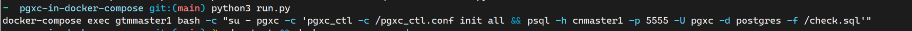
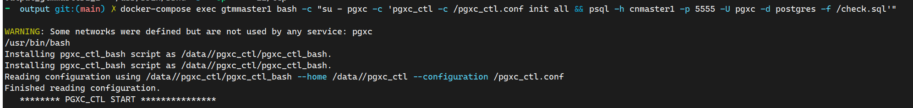
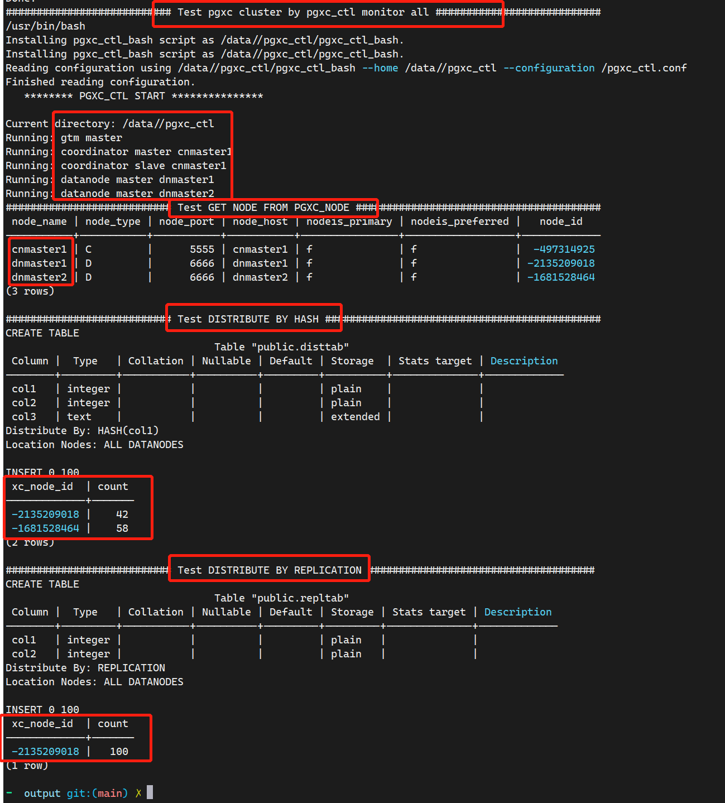

基于docker-compose快速创建不同拓扑结构的pgxc集群, 方便日常测试

<!--more-->

## 参考

项目地址: https://github.com/BigCat-byebye/pgxc-in-docker-compose/tree/main

## 使用方式

1. 克隆仓库

    ``` shell
    git clone https://github.com/BigCat-byebye/pgxc-in-docker-compose.git
    ```

2. 修改配置

    只需要修改env.ini文件中的CLUSTER.TYPE即可, 默认该值为MINIMAL

    默认提供了2个配置, 为minimal和normal, 如果懂pgxc_ctl.conf的话, 就修改custom即可

    minimal配置为1个gtm, 1个cn master, 1个cn slave, 2个dn master

    normal配置为1个gtm, 1个gtm slave, 2个cn master, 2个cn slave, 3个dn master, 3个dn slave

3. 生成配置

    默认生成的配置都会在output目录下, 同时这一步会打印出初始化的shell语句, 如下

    

    ``` shell
     python3 run.py
     ```
    
4. 运行docker-compose环境

    ``` shell
    cd output && docker-compose up -d
    ```

5. 初始化集群

    粘贴步骤3的输出语句即可初始化集群, 如下
    
    
    
    初始化集群的结果, 可验证如下

    

6. 环境清理

    6.1 停止docker-compose

    ``` shell
    cd output && docker-compose down
    ```

    6.2 删除output目录

    ``` shell
    rm -rf output
    ```

