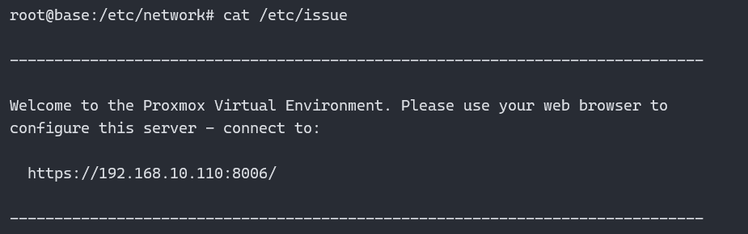
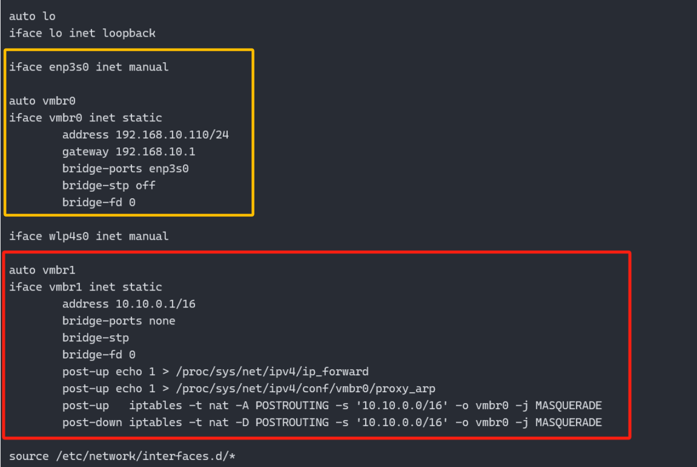
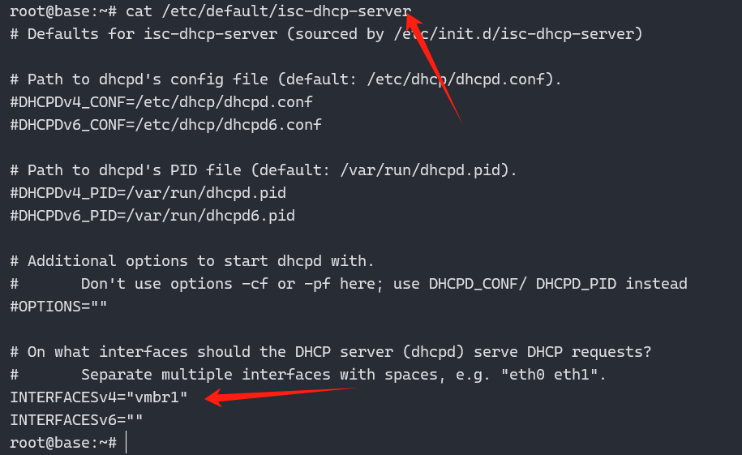
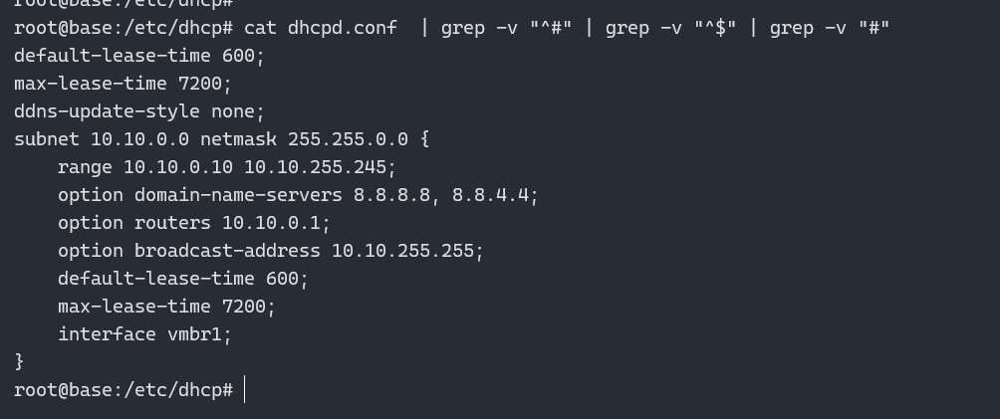
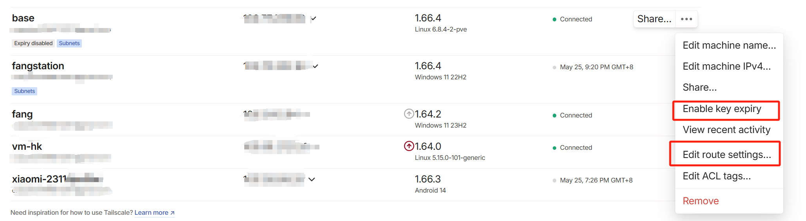
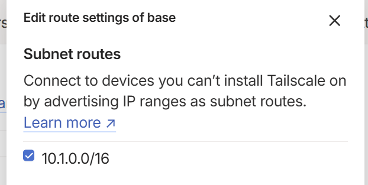
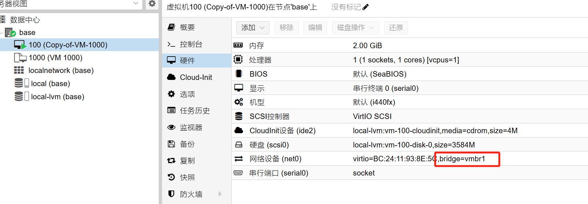
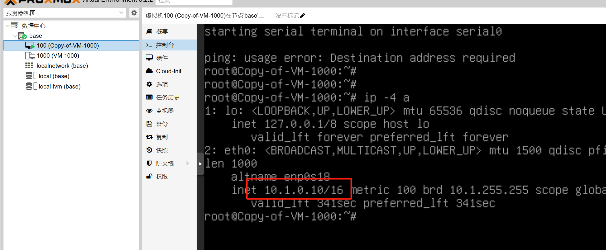
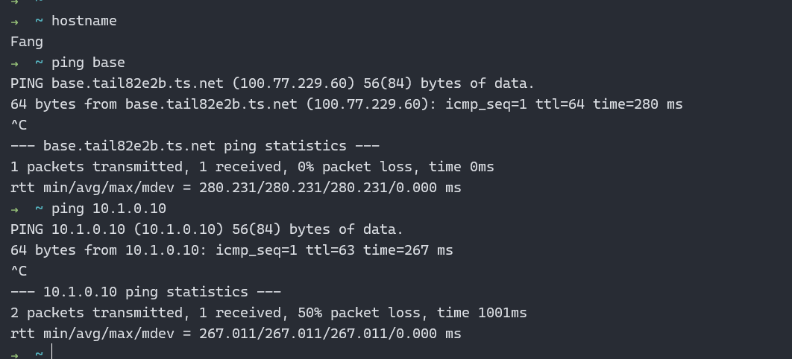

基于proxmox 8.2以及tailscale搭建1个Homelab, 方便各项技术测试

<!--more-->

## 参考

[Proxmox 8.2官网]([Download Proxmox software, datasheets, agreements](https://www.proxmox.com/en/downloads))

[Rufus刻录工具](https://rufus.ie/zh/)

[Proxmox网络设置](https://pve-doc-cn.readthedocs.io/zh-cn/latest/chapter_system_administration/netconfig.html)

[Tailscale中subnet功能](https://tailscale.com/kb/1019/subnets)

## 部署Proxmox

直接使用Rufus刻录proxmox的iso镜像即可,注意**不要使用ventoy, 会报错!!!**



**安装过程中, 很顺滑, 直接按照提示, 每次都下一步即可, 基本不会出错, 小白也能成功, 这里就不细讲了**

部署之后, 界面会打印出proxmox的web地址, 访问后, 输入自己在部署过程中设置的密码就好

### 新增网卡vmbr1

默认的proxmox的网络模式是桥接, 即创建1个网桥, 并**将识别到的第一个网卡接入到网桥的一端, 而且将ip地址放到网桥上, 注意哈, 不是放在网卡上**,** 下图中,

注意**我这里的第一块网卡是enp3s0**, 在这里, 我们新建1个网卡vmbr1作为给后续虚拟机使用的网段,  黄色框是默认的proxmox网络配置, 其中红色框是新增的网卡vmbr1



**说明**: 这样做的原因是为了方便后面带着homelab迁移的时候, 方便点, 可以直接使用, **比如现在的路由器网段是192.168.10.0/24, 如果采用默认的网络模式, 那么创建的虚拟机, 都会自动获取到192.168.10.0/24段, 如果搬家之后, 路由器网段变成了192.168.11.0/24, 那虚拟机获取的网络就有可能从原来的192.168.10.0/24变成192.168.11.0/24段, 虚拟机上的服务可能会收到影响, 因此新建1个vmbr1的网卡, 然后创建虚拟机的时候, 使用这张网卡, 这样子, 无论环境怎么变化, 虚拟机的ip都不会受到影响**

**重要**: 这里需要额外注意下, 这个给vmbr1的ip最好是网关ip, 一般网关都是网段内的第一个ip, 即如上的10.10.0.1, 因为需要配置到dhcpd的地址池中充当网关

## 部署dhcpd

因为默认的proxmox是没有部署dhcpd, 因此如果不自建dhcpd, 那么创建虚拟机的时候, 虽然网卡选择到了vmbr1, 但是由于没有dhcpd, 就会导致虚拟机无法获取到ip

``` shell
apt install -y isc-dhcp-server
```

### 修改监听网卡

修改配置文件/etc/default/isc-dhcp-server如下



### 创建地址池

注意, 下面的option routes表示该地址池的网关地址(**一般是网段内的第一个**), 注意填写为创建的vmbr1的地址, option broadcase-address表示地址池的广播地址(**一般是网段内的最后一个**)



## 安装Tailscale

登录到proxmox上, 执行安装脚本

```shell
curl -fsSL https://tailscale.com/install.sh | sh
```

跟随打印出来的Web Url指引, 在web界面上认证该设备, 然后就安装成功了

### 配置ip转发

```shell
echo 'net.ipv4.ip_forward = 1' | sudo tee -a /etc/sysctl.d/99-tailscale.conf
echo 'net.ipv6.conf.all.forwarding = 1' | sudo tee -a /etc/sysctl.d/99-tailscale.conf
sudo sysctl -p /etc/sysctl.d/99-tailscale.conf
```

### 开启子网

```shell
 tailscale up --advertise-routes  10.1.0.0/16 --accept-routes
```

### 启用子网

登录到tailscale的web页面, 修改如下图



1. 关闭key过期

2. 编辑route设置

   

   上面**开启子网**之后, 点击Edit route settings 就会出现这个subnet route选项, 勾选即可启用该子网, 那么这个子网内的设备, 就同可以通过tailscale访问了, 而不需要安装tailescale客户端

## 创建虚拟机

**备注**: 网卡记得一定要选择刚才新建vmbr1网卡



可以看到虚拟机可以正常的获取到ip, **这里获取的ip是10.1段, 与上面配置的10.10不符合, 是因为后面重新规划了网段, 把原来规划的10.10段改成10.1段了**




## 验证

从我的笔记本访问pve上创建的虚拟机, 该虚拟机上没有安装tailscale, 但是pve上安装了tailsacele, 并且开启了子网, 验证如下



可以看到能够正常的访问新建的虚拟机了
