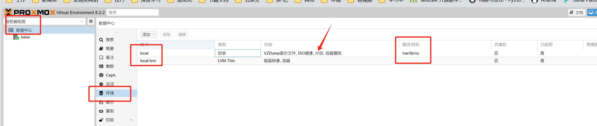
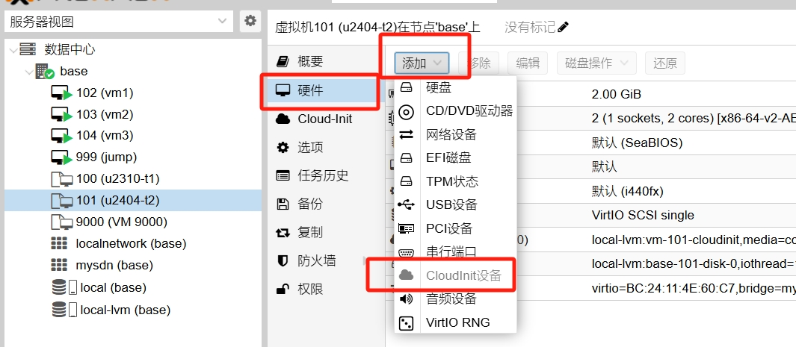
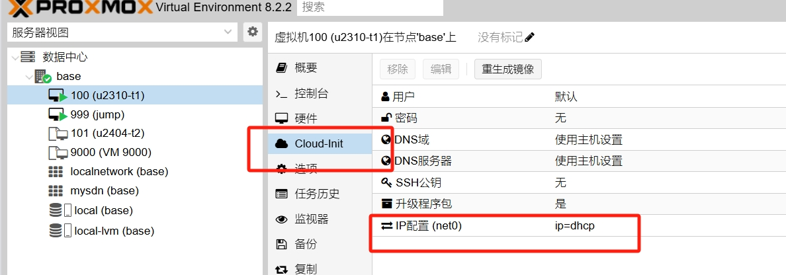
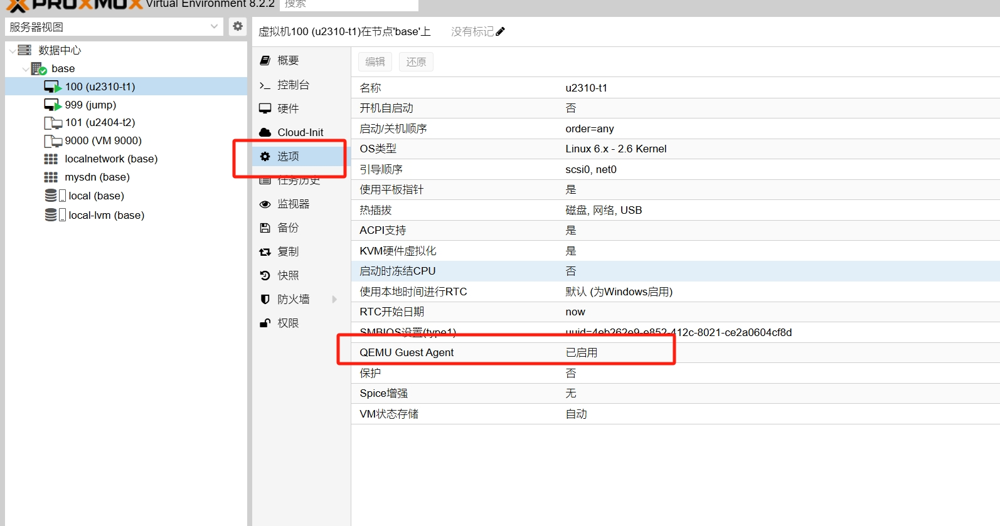
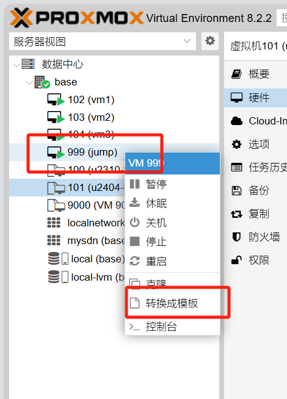
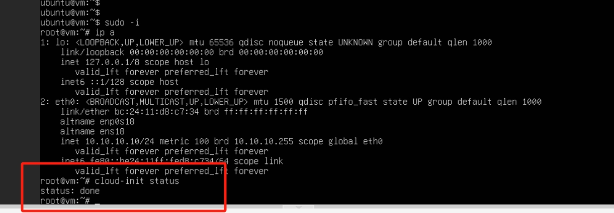
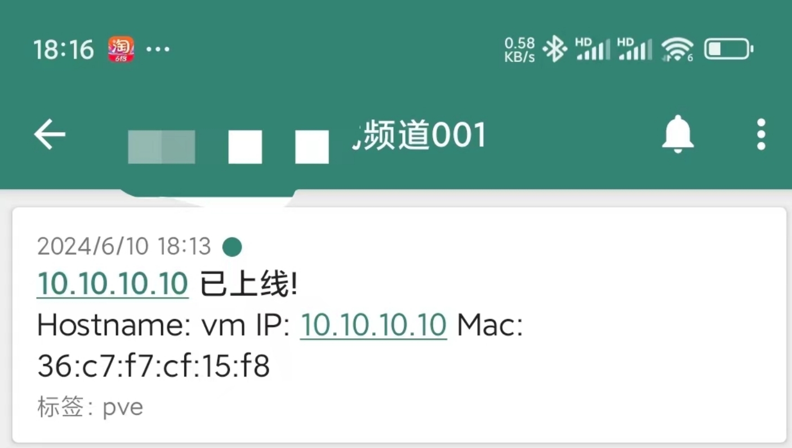

最近想搞个环境做k8s的测试了, 家中刚好有个电脑, 一直放那吃灰, 索性就用起来, 最终弄成的效果就是根据模板创建环境即用, 只需要设置对应的cpu和mem就好, 至于密钥, 密码, 账号等, 全部都提前设置在模板里面了

**在这里吐槽下, 本来只是想装1个自定义的镜像的, 但是很讨厌ubuntu用的snap, 因此就想自己搞一个完全自定义的镜像, 不知道是我理解能力太差还是什么问题, 找遍了全网的博客, 都没找到一个能从头跑到尾教程, 简直气死我了, 如果需要从头到尾自定义1个cloudinnt的镜像, 完全可以参照我的文章, 从头到尾走下去, 就可以完全自定义1个镜像**

备注: 如果完全对cloud-init不了解的话, 那就照抄本文的步骤, 所有的固定的步骤, 都写在最后的vm-startup.sh里面算了, 这个脚本, 每次开机都会运行的, 如果有兴趣的话, 建议先看一下cloud-init的官网, 也就是下文的参考部分

<!--more-->

## 参考

[Cloud-init官方示例](https://cloudinit.readthedocs.io/en/latest/reference/examples.html)

[Cloud-init官网教学](https://cloudinit.readthedocs.io/en/latest/tutorial/index.html)

[禁止cloud-init启动]([How to disable cloud-init - cloud-init 24.1.7 documentation (cloudinit.readthedocs.io)](https://cloudinit.readthedocs.io/en/latest/howto/disable_cloud_init.html))

[修改模块的运行频率]([How to change a module’s run frequency - cloud-init 24.1.7 documentation (cloudinit.readthedocs.io)](https://cloudinit.readthedocs.io/en/latest/howto/module_run_frequency.html))

[Runcmd模块介绍]([Module reference - cloud-init 24.1.7 documentation (cloudinit.readthedocs.io)](https://cloudinit.readthedocs.io/en/latest/reference/modules.html#runcmd))

## 创建VM

找个自定义的镜像, 一步步按照提示安装系统, 这里其实可以直接用官方提供的cloud-init镜像的, 但是本人很讨厌ubuntu 的snap方式, 因此一定要自己手动装一个系统, 这里也讲一下划分信息

| 配置项         | 配置值                                         |
| -------------- | ---------------------------------------------- |
| 系统           | Linux                                          |
| 系统版本       | Ubuntu 23 10 Minimal                           |
| Cpu            | 2                                              |
| Mem            | 2G                                             |
| 系统盘         | 15G(这里直接给15G, 就懒得再给个额外的数据盘了) |
| 磁盘分区/boot/ | 1G                                             |
| 磁盘分区/      | 5G                                             |
| 磁盘分区/var/  | 剩余所有                                       |
| 网络设置       | dhcp                                           |
| 用户名         | ubuntu                                         |
| 用户密码       | 123456                                         |
| 开启ssh-server | 是                                             |

这样装的系统下来, 就没有snap了, **就非常好**

## 配置VM

创建了上述的vm之后, 登录后, 直接执行安装命令

```shell
apt install -y cloud-init
```

安装了cloud-init之后, 直接从界面上点击clone, 生成1个一模一样的vm, 然后后续**所有的操作都是针对这个clone的vm的, 这样做是为了防止, 测试弄错了,  又要重新装系统, 太浪费时间了**

## 配置cloud-init

### 删除disable文件

简单来讲就是删除掉/etc/cloud/cloud-init.disable, 因为cloud-init在运行的时候, 如果检测到了这个文件,就会认为这个机器已经被初始化过,就不会执行初始化任务, **这一点, 找到的一些博客基本完全没有讲, 真的是气死我了**

```shell
root@vm:/etc/cloud# pwd
/etc/cloud
root@vm:/etc/cloud# ls
clean.d  cloud-init.disabled  cloud.cfg  cloud.cfg.d  ds-identify.cfg  templates
root@vm:/etc/cloud# rm -rf cloud-init.disabled
```

### 修改运行频率

**默认cloud-init的配置文件是/etc/cloud/cloud-init.cfg, 但是其中定义的各个模块的运行频率都只有1次**, 但是我这里有需求, 就是每次vm重启之后, 我希望能自动发消息到ntfy去通知我, 因此我将该模块设置为always,也就是每次启动的时候, 都运行该模块, 这里需要解释下, run-cmd模块都是在final-stage的scripts_user模块中执行的, 因此我们修改scripts_user的频率

```shell
root@vm:/etc/cloud# pwd
/etc/cloud
root@vm:/etc/cloud# grep -C 3 "scripts_user" cloud.cfg
- scripts_per_once
- scripts_per_boot
- scripts_per_instance
- [scripts_user, always]
- ssh_authkey_fingerprints
- keys_to_console
- install_hotplug
root@vm:/etc/cloud#
```

### 清理cloud-init

这一步必须要做, 因为只有这样才能去除cloud-init的安装痕迹, 下次重启这个vm的时候, 才会运行cloud-init
```shell
 cloud-init clean -c all
```

## 编写user-data
cloud-init的配置, 按照我的理解主要分为2部分, 1个是/etc/cloud/下的配置文件,, 另外1部分就是user-data, network-data, meta-data, vendor-data这4个文件

- /etc/cloud: 定义cloud-init的执行过程, 也就是官网说的stage
- 参数配置
  - meta-data: 定义系统的元数据, 一般来讲, 里面就1个id
  - network-data: 定义系统的网络部分, 一般来讲dhcp是最好的了
  - vendor-data: 云厂商定义的数据内容部分,  本次用的pve, 因此直接就是nocloud, 这个文件也不用写
  - user-data: 常用的定义部分, 经常改动的也就是这部分了, 比如预定义的用户密钥, 安装包等

这里如果不知道怎么写的话, 其实可以找1个模板, 就是从刚才的虚拟机中找一个模板, 其中999是虚拟机的id哈, 可以导出user, network, meta的信息,

```shell
qm cloudinit dump 999 user
```

如下, 这样子导出user之后, 就可以得到加密之后的password字段了, 因为我前面虚拟机的密码是123456, 因此这个密码我知道是123456哈, 当然了, 有兴趣的话, 可以百度下怎么生成密码

```shell
root@base:~# qm list
      VMID NAME                 STATUS     MEM(MB)    BOOTDISK(GB) PID
       100 u2310-t1             stopped    2048              15.00 0
       101 u2404-t2             stopped    2048              15.00 0
       102 vm1                  running    2048              15.00 3964139
       103 vm2                  running    2048              15.00 3964229
       104 vm3                  running    2048              15.00 3964049
       999 jump                 running    2048               8.50 3601319
      9000 VM 9000              stopped    2048               8.50 0
root@base:~# qm cloudinit dump 999 user
#cloud-config
hostname: jump
manage_etc_hosts: true
fqdn: jump
user: ubuntu
password: 66666666666666666666
ssh_authorized_keys:
  - ssh-rsa A6666666666666666666666666666666666666RAr root@zhibo
chpasswd:
  expire: False
users:
  - default

root@base:~# qm cloudinit dump 999 network
version: 1
config:
    - type: physical
      name: eth0
      mac_address: 'bc:24:11:e9:f6:f1'
      subnets:
      - type: dhcp4
    - type: nameserver
      address:
      - '100.100.100.100'
      search:
      - 'tail82234b.ts.net'

root@base:~# qm cloudinit dump 999 meta
instance-id: c21915fba7123826529375024b20b0bb

root@base:~# 
```

写一个配置文件cloud-init.txt, 将获取user的信息, 贴进去, 然后加一些自己定义的字段, **注意哈, 其中的password和ssh_authorized_keys我都乱改了一通, 所有这个地方, 用你在上面命令中导出的哦, 不然的话, 我也不知道密码是多少了**

```shell
root@base:~/test# cat cloud-init.txt
#cloud-config

hostname: vm
manage_etc_hosts: true
fqdn: vm
user: ubuntu
password: 66666666666666666666
ssh_authorized_keys:
  - ssh-rsa A6666666666666666666666666666666666666RAr root@zhibo
disable_root: false
chpasswd:
  expire: False
users:
  - default
  - name: ubuntu
    gecos: Default User
    shell: /bin/bash
    groups: users,admin,wheel
    sudo: ALL=(ALL) NOPASSWD:ALL
no_ssh_fingerprints: false

package_upgrade: true
packages:
  - vim
  - telnet
  - iputils-ping
  - net-tools
  - qemu-guest-agent

write_files:
  - owner: root:root
    path: /root/vm-startup.sh
    defer: true
    content: |
      #!/bin/bash
      ntfy_url="https://ntfy.sh/23523B235235235201"
      vm_default_net_device=$(ip r  | grep -w "default via" | awk '{print $5}')
      vm_default_ip=$(ip r  | grep -w "default via" | awk '{print $9}')
      vm_mac=$(ip l | grep -A1 -w "^2: $vm_default_net_device" | tail -n 1 | cut -d" " -f6)
      hostnamectl set-hostname $(echo $vm_default_ip | tr "." "-")
      vm_hostname=$(hostname)
      curl -H "Title: $vm_default_ip 已上线!" -H 'Tags: pve' -d "Hostname: $vm_hostname IP: $vm_default_ip Mac: $vm_mac" $ntfy_url

runcmd:
  - sleep 3
  - bash /root/vm-startup.sh

root@base:~/test#
```

## 将脚本放到对应的pve目录

这里通过数据中心>存储可以看到pve是默认有2个存储的, 分别是local和local-lvm, 我这里用的是local, 可以看到local对应的目录是/var/lib/vz/目录, 默认的local是不能存储片段的, 因此双击一下, 就可以编辑, 然后选择一下片段即可



然后将上面创建的clout-init.txt放到local的片段下, 如下

```shell
root@base:~# cp cloud-init.txt /var/lib/vz/snippets/
root@base:~# ls /var/lib/vz/snippets/
cloud-init.txt
root@base:~#
```

上面的片段也就是snippets的意思

## 配置cloud-init设备

在pve的操作界面上, 给虚拟机加上一个cloud-init设备即可



添加完后, 在虚拟机的cloud-init选项中将IP配置改成dncp, 这样就不用手动写network了


在虚拟机的选项配置中, 开启qume-guest-agent, 这是为了后面可以从pve使用qm guest命令操作虚拟机


## 配置自定义cloud-init
这里的local是pve中存储local的位置哈, 这里的local:snippets/cloud-init.txt其实就是指刚才复制到local的片段里面的clout-init.txt文件, local代表/var/lib/vz/目录, 使用qm set以及--cicustom配置虚拟机的自定义数据, 其中user是指配置user-data, **也可以单独配置network或者meta, 如果不配置的话, network和meta就会由pve自动产生**


```shell
root@base:~/test# qm set 100 --cicustom "user=local:snippets/cloud-init.txt"
update VM 100: -cicustom user=local:snippets/cloud-init.txt
root@base:~/test#
```

## 再次清理

为了防止失误, 就再次清理下

```shell
cloud-init clean -c all
```

## 生成模板

上述配置结束后, 在pve界面将虚拟机关机, 然后转换为模板, **注意哈, 转换为模板, 需要虚拟机先关机**



## 验证

### 验证虚拟机

在pve的界面, 点击模板, 克隆1个虚拟机, 然后开机即可, 可以从控制到看到开机日志, 确认是否在执行cloud-init

### 验证cloud-init状态

虚拟机开机后, 使用自己的密钥登录虚拟机, 执行clond-init status, 运行结果为done, 则说明cloud-init正常运行结束了, 如下



### 验证ntfy的消息


可以看到正常的收到了发送消息