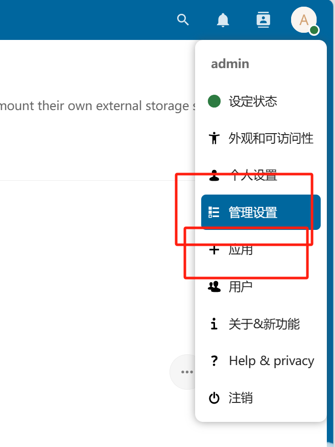
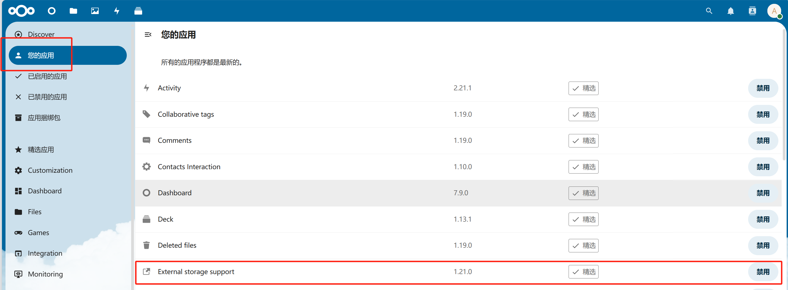
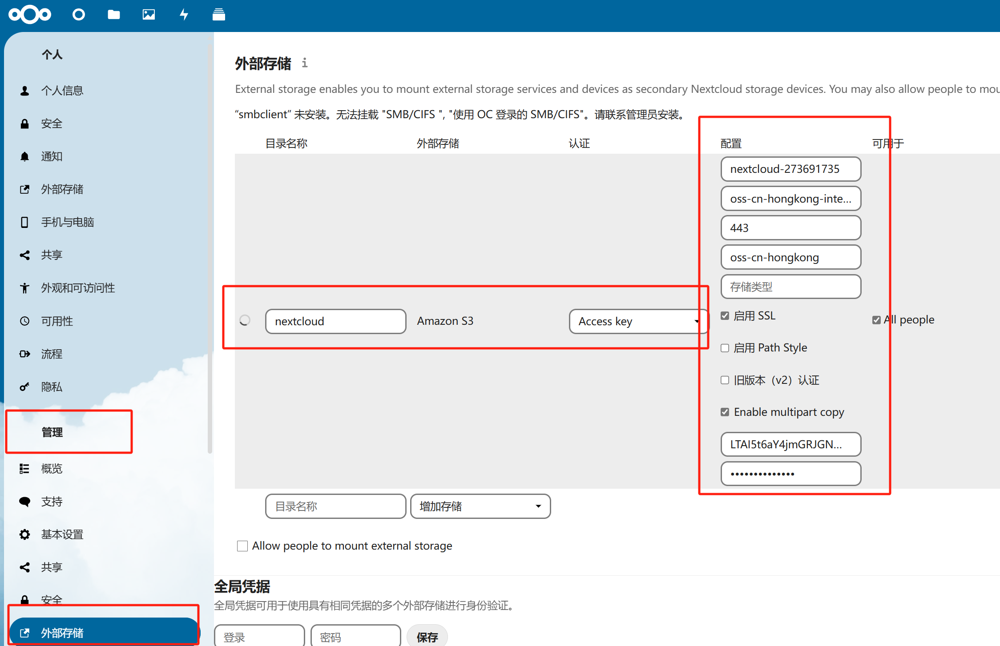
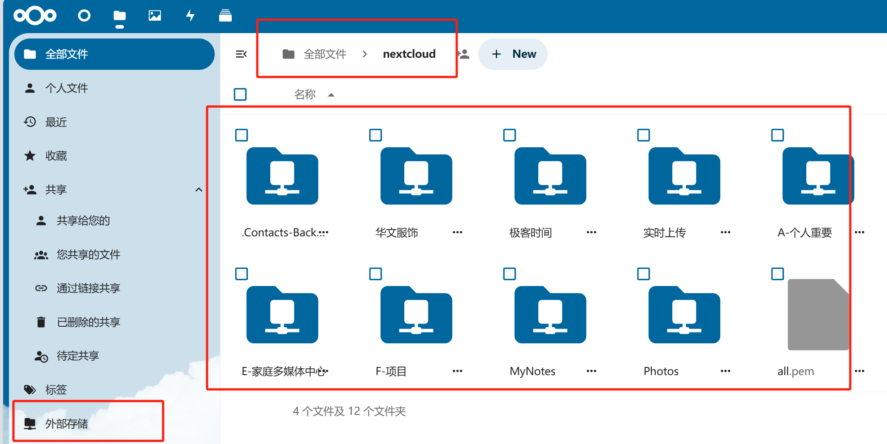
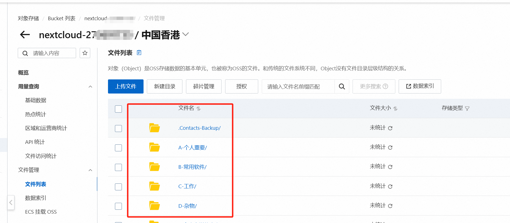

之前腾讯云买的3年的轻量服务器到期了, 然后nextcloud也要到期了, 就得想办法迁移下, 之前在阿里云买了个香港的服务器, 买的最小的按量计费的那种, 主要用来做fq的, 但是因为fq的软件一直都没挂, 就准备在上面搞个nextcloud, 然后把数据放在s3上, 尽量整便宜点, 毕竟要用好几年, 

备注: nextcloud是个私有网盘, 可以完全自主搭建, 而且提供移动端和电脑端还有服务器端, 而且可以对接很多的外部存储, 本来想着是把oss作为nextcloud的主存储, 这样子就不用占用服务器空间了, 但是发现, 如果是作为主存储, 存储到服务器中的数据被重新命名了, 也就是数据结构会变, 变成了orn:oid:这种开头了, 而如果使用外部存储的话, 可以保留数据结构, 因此就还是不作为主存储了.

## 准备
- 1台香港的服务器, 1c1g20g,带宽100M, 按量计费
- 开通阿里云的nas(容量型)以及oss(标准型)

## 搭建
docker-compose的yaml文件如下
```yaml
[root@forward-hk-01 nextcloud]# cat docker-compose.yaml
version: '3.5'

services:
  db:
    image: mariadb:10.5
    restart: unless-stopped
    environment:
      # mysql的账号密码相关
      - MARIADB_ROOT_PASSWORD=AdminMariadb0.0
      - MARIADB_DATABASE=nextcloud
      - MARIADB_USER=mysql_user
      - MARIADB_PASSWORD=WoDeMariadb0.0
    volumes:
      - /data/mysql:/var/lib/mysql:rw
    command: --transaction-isolation=READ-COMMITTED --binlog-format=ROW
  redis:
    image: redis:alpine
    restart: unless-stopped
  app:
    image: nextcloud:stable
    restart: unless-stopped
    depends_on:
      - db
      - redis
    environment:
      # nextcloud的可信域名
      - NEXTCLOUD_TRUSTED_DOMAINS=cloud.kengdie.xyz
      # 设置nextcloud的账号密码
      - NEXTCLOUD_ADMIN_USER=xxxxxxxxx
      - NEXTCLOUD_ADMIN_PASSWORD=xxxxxxxxxxxxx
      - NEXTCLOUD_INIT_HTACCESS=true
      # nextcloud的域名
      - OVERWRITEHOST=cloud.kengdie.xyz
      # nextcloud的访问协议
      - OVERWRITEPROTOCOL=https
      # php上传时候允许的大小
      - PHP_UPLOAD_LIMIT=10240M
      # apache上传文件的大小, 0表示不限制
      - APACHE_BODY_LIMIT=0
      # 使用的redis信息
      - REDIS_HOST=redis
      # 使用的mysql信息
      - MYSQL_HOST=db
      - MYSQL_DATABASE=nextcloud
      - MYSQL_USER=mysql_user
      - MYSQL_PASSWORD=WoDeMariadb0.0
    ports:
      # 对外开放的端口
      - 20080:80
    volumes:
      - /data/html:/var/www/html:rw
  cron:
    image: nextcloud:stable
    restart: unless-stopped
    depends_on:
      - db
      - redis
    volumes:
      - /data/html:/var/www/html:rw
    entrypoint: /cron.sh
```
修改其中需要设置的值即可

在目录中配置好上面的docker-compose文件, 然后直接docker-compose up -d 即可, 然后访问你设置的域名和端口就好


## 迁移数据
因为我原来的数据在腾讯云的轻量服务器上, 当初用的本地磁盘, 随着服务器退运, 磁盘也会没了, 因此在阿里云上开了个oss, 然后用ossutils命令行将文件上传到bucket里面

安装ossutils

```shell
[root@vm-tx ~]$ ===>>> wget': wget https://gosspublic.alicdn.com/ossutil/v2-beta/2.0.2-beta.08282000/ossutil-2.0.2-beta.08282000-linux-amd64.zip
```
编写配置文件

```shell
[root@vm-tx ~]$ ===>>> cat /root/.ossutilconfig
[default]
accessKeyId=LTAI5t6aY4dsadfTQFpZ
accessKeySecret=XzPwnwG23253WAsURkrZyE
endpoint=https://oss-cn-hongkong.aliyuncs.com
region=cn-hongkong
```

这里请使用自己的accesskeyid和accesskeysecret, 我这里的肯定已经不是我的了

进入到之前nextcloud的数据目录, nextcloud安装目录/data/admin/files/下
```shell
[root@vm-tx files]$ ===>>> pwd
/mydata/nextcloud/data-nextcloud/data/admin/files
[root@vm-tx files]$ ===>>> ls
A-个人重要  B-常用软件  C-工作  D-杂物  E-家庭多媒体中心  F-项目  Important  MyNotes  ossutil_output  Photos  华文服饰  实时上传  极客时间
```

查看oss, 确认配置文件正常
```shell
[root@vm-tx files]$ ===>>> ossutil ls oss://nextcloud-273691735

LastModifiedTime                   Size(B)  StorageClass   ETAG                                  ObjectName
2024-09-08 13:14:44 +0800 CST         1675      Standard   1E80C0D090C31CA43E5C294C2B1CB1E0      oss://nextcloud-273691735/all.pem
2024-09-08 13:14:44 +0800 CST          392      Standard   D52CBE5D78F38E1B56AC26B1124E71BC      oss://nextcloud-273691735/all.pem.pub
2024-09-08 13:27:25 +0800 CST           93      Standard   EA807028FDAF7B8EFC94B3E7E18ACCE8      oss://nextcloud-273691735/kms.bat
2024-09-08 13:26:42 +0800 CST     84256990      Standard   A315753774CFDE7724A0F0A5F8EA4A97      oss://nextcloud-273691735/typora-1.5.8激活版.zip
Object Number is: 4

2.452984(s) elapsed
```

同步目录到oss
```shell
[root@vm-tx files]$ ===>>> ossutil sync -j 30 . oss://nextcloud-273691735/
Total 22436 files,32.363 GiB,2562 dirs, Upload... done:(4245 objects,6.756 GiB,474 dirs), 22.213%, avg 863.184 KiB/s
```

监控同步进程, shell如下
```shell
while true; do if ps aux | grep -v grep | grep ossutil; then sleep 1 ; else curl -d "ossutil sync test" ntfy.sh/xxxxxxxxxx1 ;fi ;done
```
这里使用的是ntfy, 只需要发1个请求到ntfy就可以了, 这样的当ossutils同步完后, 这个进程结束了, 就会自动发请求到ntfy, 这样子, 我就可以收到消息了

## nextcloud上配置外部存储

登录nextcloud在, 右上角个人设置那里, 选择应用, 开启External Storage Support后, 就可以配置外部存储了


进入右上角个人设置, 选择管理设置, 在管理中选择外部存储, 配置oss相关信息, 如下


配置好, 之后, 切换到首页, 选择外部存储, 就可以看到oss中的文件了


登录到oss的管理控制台, 也可以看到nextcloud中上传的文件了, 如下
