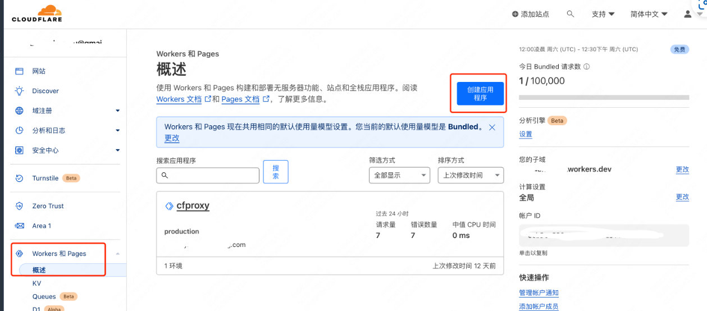
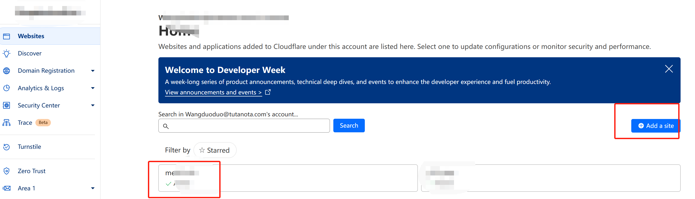
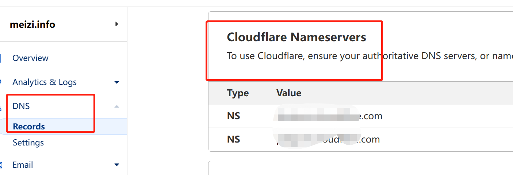
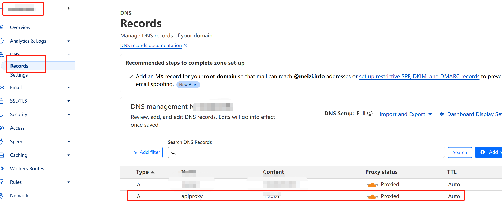
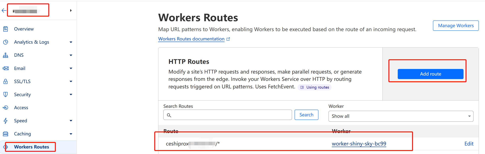
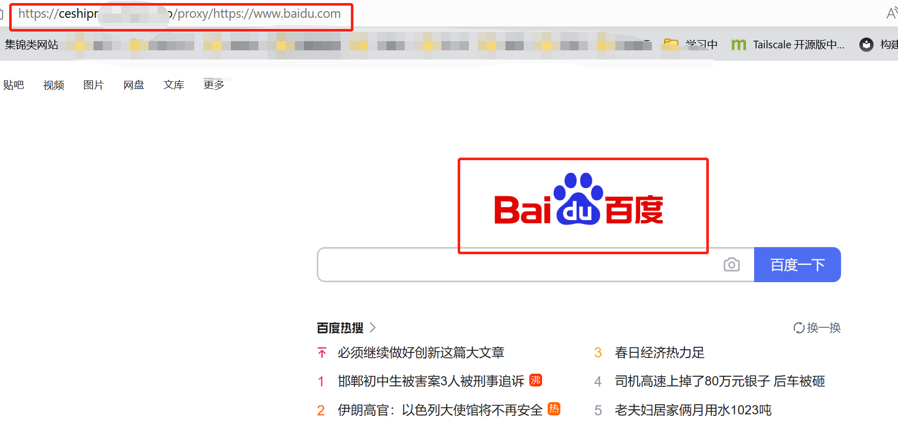

使用cloudflare的worker对api接口进行反向代理，可以在国内访问到一些无法访问的api服务，比如说openai或者telegram的api接口

<!--more-->

## 参考
https://github.com/gaboolic/cloudflare-reverse-proxy

## 方法

1. 登录cloudflare官网, 新建1个website

2. 创建1个应用程序


3. 创建1个worker, 并部署

4. 编辑worker的代码, 填写如下

``` javascript
addEventListener('fetch', event => {
  event.respondWith(handleRequest(event.request))
})

async function handleRequest(request) {
  const url = new URL(request.url);

  // 新增：检查用户是否直接访问代理地址
  if (url.pathname === '/' || url.pathname === '/proxy/') {
    return createLandingPage();
  }

  const actualUrlStr = url.pathname.replace("/proxy/","") + url.search + url.hash

  const actualUrl = new URL(actualUrlStr)

  const modifiedRequest = new Request(actualUrl, {
    headers: request.headers,
    method: request.method,
    body: request.body,
    redirect: 'follow'
  });

  const response = await fetch(modifiedRequest);
  const modifiedResponse = new Response(response.body, response);

  // 添加允许跨域访问的响应头
  modifiedResponse.headers.set('Access-Control-Allow-Origin', '*');

  return modifiedResponse;
}

// 新增：创建引导页面
function createLandingPage() {
  const html = `
  <!DOCTYPE html>
  <html lang="en">
  <head>
  <style>
  body {
    background-color: #fbfbfb;
    font-family: Arial, sans-serif;
  }

  h1 {
    text-align: center;
    color: #444;
  }

  .container {
    display: flex;
    flex-direction: column;
    justify-content: center;
    align-items: center;
    height: 100vh;
  }

  form {
    background-color: white;
    box-shadow: 0 3px 6px rgba(0, 0, 0, 0.16), 0 3px 6px rgba(0, 0, 0, 0.23);
    padding: 2rem;
    border-radius: 8px;
  }

  input {
    display: block;
    width: 100%;
    font-size: 18px;
    padding: 15px;
    border: solid 1px #ccc;
    border-radius: 4px;
    margin: 1rem 0;
  }

  button {
    padding: 15px;
    background-color: #0288d1;
    color: white;
    font-size: 18px;
    border: none;
    border-radius: 4px;
    cursor: pointer;
    width: 100%;
  }

  button:hover {
    background-color: #039BE5;
  }
</style>
    <meta charset="UTF-8">
    <title>代理服务器</title>
  </head>
  <body>
    <h1>输入您想访问的网址</h1>
    <form id="proxy-form">
      <input type="text" id="url" name="url" placeholder="https://example.com" required />
      <button type="submit">访问</button>
    </form>
    <script>
      const form = document.getElementById('proxy-form');
      form.addEventListener('submit', event => {
        event.preventDefault();
        const input = document.getElementById('url');
        const actualUrl = input.value;
        const proxyUrl = '/proxy/' + actualUrl;
        location.href = proxyUrl;
      });
    </script>
  </body>
  </html>
  `;
  
  return new Response(html, {
    headers: { 'Content-Type': 'text/html' }
  });
}
```

5. 设置自定义子域名
默认分配的域名是work.dev这种, 但是众所周知, 天朝使用不了，因此最好使用自己的自定义域名

    5.1 在cloudflare中新建1个网站

    

    5.2 前往域名服务商, 将域名的dns服务器改成cloudflare的

    

    5.3 给域名添加1个A记录

    切记: 一定要选择proxied, 其中Content随便写一个ip就好

    

    5.4 添加1个worker route, 如下

    route填写刚才的A记录, worker选择前面创建的worker即可

    


6. 验证

访问刚才设置的子域名加上/proxy/加上目的域名即可, 如: https://ceshiproxy.xxxx.bbs/proxy/https://www.baidu.com

