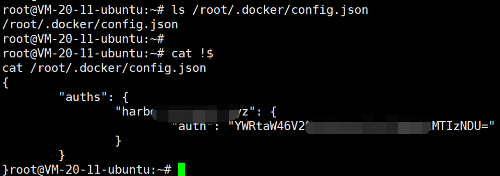

使用kind快速创建k8s的测试环境, 方便平时测试

<!--more-->

## 参考

kind官网: https://kind.sigs.k8s.io/

## 集群创建

### Kind下载

直接去github上下载即可: https://github.com/kubernetes-sigs/kind/releases

### 私有仓库配置文件

准备1个私有仓库的认证文件，这样的话，kind就可以从私有仓库中拉取镜像了

1. 本机使用docker login 登录一下私有仓库

2. 登录后，私有仓库的认证文件路径就是~/.docker/config.json了

    

### Kind集群配置文件

创建1个cluster.yaml文件, 如下

``` yaml
kind: Cluster
apiVersion: kind.x-k8s.io/v1alpha4
name: cks
featureGates:
  # any feature gate can be enabled here with "Name": true
  # or disabled here with "Name": false
  # not all feature gates are tested, however
  "CSIMigration": true 
networking:
  apiServerAddress: "0.0.0.0" ## APIserver监听地址
  # WARNING: It is _strongly_ recommended that you keep this the default
  # (127.0.0.1) for security reasons. However it is possible to change this.
  # By default the API server listens on a random open port.
  # You may choose a specific port but probably don't need to in most cases.
  # Using a random port makes it easier to spin up multiple clusters.
  apiServerPort: 36443 ## APIserver监听端口
  podSubnet: "10.199.0.0/16" 
  serviceSubnet: "10.200.0.0/16"
  # the default CNI will not be installed
  disableDefaultCNI: false ## 是否关闭默认的cni
  kubeProxyMode: "ipvs"
containerdConfigPatches:
- |-
  [plugins."io.containerd.grpc.v1.cri".registry.mirrors."harbor.kengdie.xyz"]
    endpoint = ["http://harbor.kengdie.xyz"]
nodes:
- role: control-plane
  image: harbor.kengdie.xyz/k8s/kindest/node:v1.24.0
  kubeadmConfigPatches:
  - |
    kind: ClusterConfiguration
    apiServer: ## APIserver的参数配置
        certSANs:
        - "cks.kengdie.xyz" ## APIserver使用的证书，允许访问的地址，这样子，就可以内网穿透后远程使用kubeconfig和k8s去交互了，不会报告证书错误了
        - "127.0.0.1"
        - "localhost"
        - "0.0.0.0"
        extraArgs: ## APIserver的参数设置
          service-node-port-range: "30000-40000"
          enable-admission-plugins: "NodeRestriction,MutatingAdmissionWebhook,ValidatingAdmissionWebhook"
          enable-aggregator-routing: "true"
  # port forward 80 on the host to 80 on this node
  extraPortMappings:
  - containerPort: 30080 ## 将kind集群中节点的30080端口映射到本机80端口，方便后续的ingress测试
    hostPort: 80
  - containerPort: 38080
    hostPort: 8080
  - containerPort: 30443
    hostPort: 443
  extraMounts:
  - containerPath: /var/lib/kubelet/config.json ## 将私有仓库的认证文件挂载到kind集群中，这样集群就可以直接用私有仓库中拉取镜像
    hostPath: /root/kind/docker-config.json
- role: worker
  image: harbor.kengdie.xyz/k8s/kindest/node:v1.24.0
  extraMounts:
  - containerPath: /var/lib/kubelet/config.json
    hostPath: /root/kind/docker-config.json
- role: worker
  image: harbor.kengdie.xyz/k8s/kindest/node:v1.24.0
  extraMounts:
  - containerPath: /var/lib/kubelet/config.json
    hostPath: /root/kind/docker-config.json
```

### 快速创建

``` shell
kind-linux-amd64 create cluster --config=cluster.yaml
```

### 配置增强

此处贴上一些额外的配置，可以方便后续直接在宿主机上开发，比如

- 在宿主机上添加到pod和svc的路由，这样宿主机上就可以直接访问pod和svc的ip，方便测试

- 在宿主机上添加指定后缀的dns转发，这样宿主机上就可以直接访问svc的fqdn了，同样也是方便测试

执行即可

``` shell
masterip=$(docker inspect cks-control-plane -f {{.NetworkSettings.Networks.kind.IPAddress}})
ip r add 10.199.0.0/16 via $masterip
ip r add 10.200.0.0/16 via $masterip
echo -e "\e[31m Success: Add Svc And Pod Route\e[0m"

kubedns=$(kubectl get svc -n kube-system   kube-dns -o jsonpath={.spec.clusterIP})
sed -e '/^$/d' -e '/^;/d' /etc/resolv.conf | sed "1i search default.svc.cluster.local svc.cluster.local cluster.local\nnameserver $kubedns\noptions ndots:5\n" > /tmp/resolv.tmp
mv /tmp/resolv.tmp /etc/resolv.conf
echo -e "\e[31m Success: Add DNS For Svc\e[0m"
```